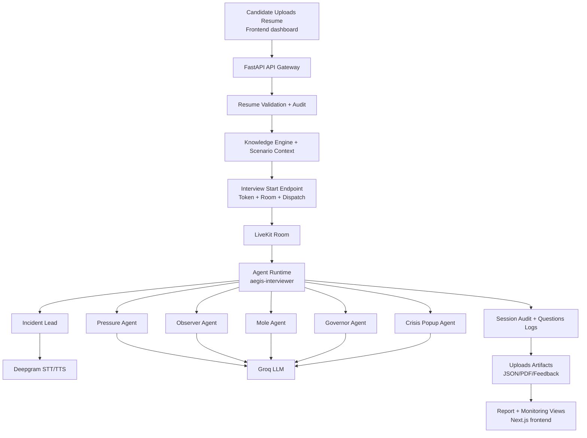

<div align="center">
  <h1>Aegis Forge</h1>
  <p><em>Real-Time Multi-Agent AI Interview Platform for Technical Hiring</em></p>

  <p>
    
    
    
    
  </p>

  <p>
    
    
    
    
    
    
    
  </p>

  <p>
    <a href="#-demo">Demo</a> -
    <a href="#-quickstart">Quickstart</a> -
    <a href="#-features">Features</a> -
    <a href="#-architecture">Architecture</a> -
    <a href="#-api">API</a>
  </p>
</div>

## 🎬 Demo

<div align="center">
  <p><strong>Public demo media coming soon.</strong></p>
</div>

> 📸 Screenshots coming soon. Star the repo to stay updated.

## 🎯 What is Aegis Forge?

Aegis Forge is a full-stack **AI interview simulation platform** that automates technical interview delivery from resume upload to post-interview reporting. It combines a **FastAPI backend**, a **LiveKit multi-agent voice runtime**, and a **Next.js frontend** for recruiter and candidate workflows. The system validates resume claims, creates role-aware interview scenarios, runs dynamic multi-agent conversations in real time, and generates structured FSIR/Q&A/feedback artifacts. It is designed for teams that need **scalable**, **consistent**, and **observable** technical assessment pipelines.

> 🏆 **Built as an advanced applied-AI interview orchestration system for production-style recruiter and candidate workflows.**

## ✨ Features

- 🎙 **Real-Time AI Voice Interviews** — Runs low-latency interview conversations using LiveKit with Deepgram STT/TTS.
- 🧠 **Multi-Agent Interview Dynamics** — Coordinates Incident Lead, Pressure, Observer, Mole, Governor, and Crisis Popup agents.
- 📄 **Resume-Aware Interviewing** — Validates resume claims and auto-adapts scenarios and questioning focus.
- 🧭 **Recruiter Control Layer** — Supports focus-topic injection and candidate-role overrides via API.
- 📊 **Telemetry + Evaluation Signals** — Captures MediaPipe metrics and agent-side events for richer assessment.
- 📝 **Artifact Generation Pipeline** — Produces report PDFs, feedback PDFs, Q&A logs, and audit JSON outputs.
- 🔐 **Session + Room Orchestration** — Generates candidate sessions, tokens, and LiveKit dispatch metadata.
- 🖥 **Full-Stack UX Surface** — Provides candidate, recruiter, room, monitor, and report routes in Next.js.

## 🏗 Architecture

<p align="center">
  
</p>



## 🛠 Tech Stack

| Layer | Technology | Purpose |
|:------|:-----------|:--------|
| Backend API | Python + FastAPI | Resume intake, session APIs, orchestration endpoints |
| Agent Runtime | LiveKit Agents | Real-time room participation and agent graph execution |
| LLM | Groq | Interview reasoning, dynamic scenario and response generation |
| Speech | Deepgram | Speech-to-text and text-to-speech for voice interview loop |
| Frontend | Next.js 16 + React 19 + TypeScript | Candidate/recruiter UI, room and report surfaces |
| Styling | Tailwind CSS 4 | Frontend utility-first styling and responsive layouts |
| Knowledge Layer | Pathway helpers + custom pipeline | Candidate context retrieval and scenario alignment |
| Reporting | ReportLab + JSON logging | FSIR/feedback PDFs and structured audit outputs |
| Tooling | uv + Ruff + Mypy + Pytest | Dependency management, linting, typing, and tests |

## ⚡ Quickstart

### Prerequisites

- Python 3.11+
- Node.js 18+
- uv package manager
- npm
- LiveKit credentials
- Groq and Deepgram API keys

### Installation

```bash
# 1. Clone the repo
git clone https://github.com/ankit-choubey/Aegis-Forge-Agent.git
cd Aegis-Forge-Agent

# 2. Create virtual environment
python -m venv .venv && source .venv/bin/activate

# 3. Install Python dependencies
uv sync --all-extras --dev

# 4. Install frontend dependencies
cd frontend && npm install && cd ..
```

### Environment Variables

Create a .env file:

```ini
# LiveKit server URL
LIVEKIT_URL=wss://your-livekit-host

# LiveKit API key
LIVEKIT_API_KEY=your_livekit_api_key

# LiveKit API secret
LIVEKIT_API_SECRET=your_livekit_api_secret

# Groq API key for LLM calls
GROQ_API_KEY=your_groq_api_key

# Deepgram API key for STT/TTS
DEEPGRAM_API_KEY=your_deepgram_api_key

# Optional Simli avatar key
SIMLI_API_KEY=your_simli_api_key

# Optional Simli face identifier
SIMLI_FACE_ID=your_simli_face_id

# Optional uploads path
UPLOADS_DIR=uploads

# Allowed CORS origins
ALLOWED_ORIGINS=http://localhost:3000

# Frontend URL for backend API
NEXT_PUBLIC_API_BASE=http://localhost:8000

# Frontend LiveKit URL
NEXT_PUBLIC_LIVEKIT_URL=wss://your-livekit-host
```

### Run

```bash
# Terminal 1: start backend
uvicorn backend.main:app --reload --port 8000

# Terminal 2: start agent runtime
python app/main.py dev

# Terminal 3: start frontend
cd frontend && npm run dev
```

## 📁 Project Structure

<details>
<summary>Click to expand</summary>

```text
.
├── README.md
├── app/
├── backend/
├── frontend/
├── deploy/
├── scripts/
├── tests/
├── documentation/
├── legal/
├── sample_resumes/
├── utility_scripts/
├── archive_apps/
├── makefile
├── pyproject.toml
└── uv.lock
```

</details>

## 📡 API

Internal orchestration and operator-only endpoints are intentionally omitted from this public README.

| Method | Endpoint | Description |
|:-------|:---------|:------------|
| GET | / | Health check |
| POST | /upload-resume | Upload and validate candidate resume |
| POST | /candidate-login | Candidate authentication |
| POST | /start-interview | Start interview room/token/dispatch flow |
| GET | /candidate/{candidate_id} | Candidate lookup |
| GET | /candidates | List candidates |
| POST | /mediapipe-metrics | Ingest behavioral telemetry |
| GET | /mediapipe-metrics/{candidate_id} | Read candidate telemetry |
| GET | /interview-results/{candidate_id} | Fetch consolidated results |
| GET | /download-report/{candidate_id} | Download report PDF |
| GET | /download-qna/{candidate_id} | Download Q&A JSON |
| GET | /download-feedback/{candidate_id} | Download feedback PDF |

## 🔮 Roadmap

- [x] End-to-end resume-to-interview orchestration
- [x] Multi-agent real-time interview runtime
- [ ] Live demo deployment with public hosted room experience
- [ ] Persistent database-backed candidate/session storage
- [ ] Expanded evaluator rubric and scoring explainability
- [ ] Recruiter analytics dashboard with historical trend views
- [ ] Hardened production auth and RBAC for recruiter controls

## 🔐 Security

Please avoid opening public issues for security vulnerabilities.

- Report security concerns privately to: ankitkumarchoubey0909@gmail.com
- Include reproduction steps, impact scope, and affected endpoints/components
- You can expect an acknowledgement within 72 hours

## 🤝 Contributing

Contributions are welcome! Here's how:

1. Fork the repo
2. Create your branch: git checkout -b feat/your-feature
3. Commit changes: git commit -m "feat: add your feature"
4. Push: git push origin feat/your-feature
5. Open a Pull Request

Please follow [Conventional Commits](https://www.conventionalcommits.org/).

## 📜 License

Distributed under the Proprietary license. See [license.md](legal/license.md) for details.

***

<div align="center">
  <p>Built with 🔥 by <a href="https://github.com/ankit-choubey">Ankit Choubey</a></p>
  <p>
    <a href="https://github.com/ankit-choubey/Aegis-Forge-Agent/issues">Report Bug</a> -
    <a href="https://github.com/ankit-choubey/Aegis-Forge-Agent/issues">Request Feature</a>
  </p>
</div>